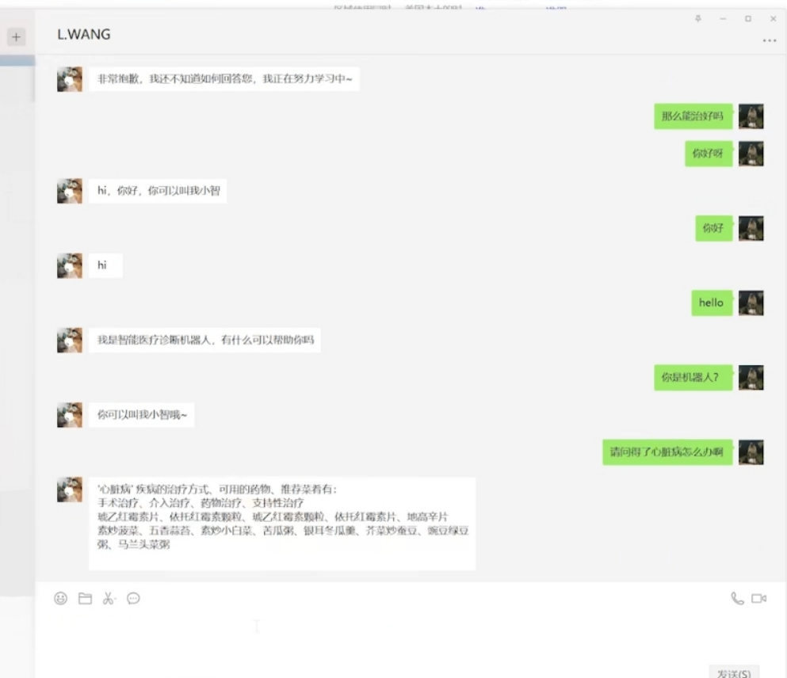
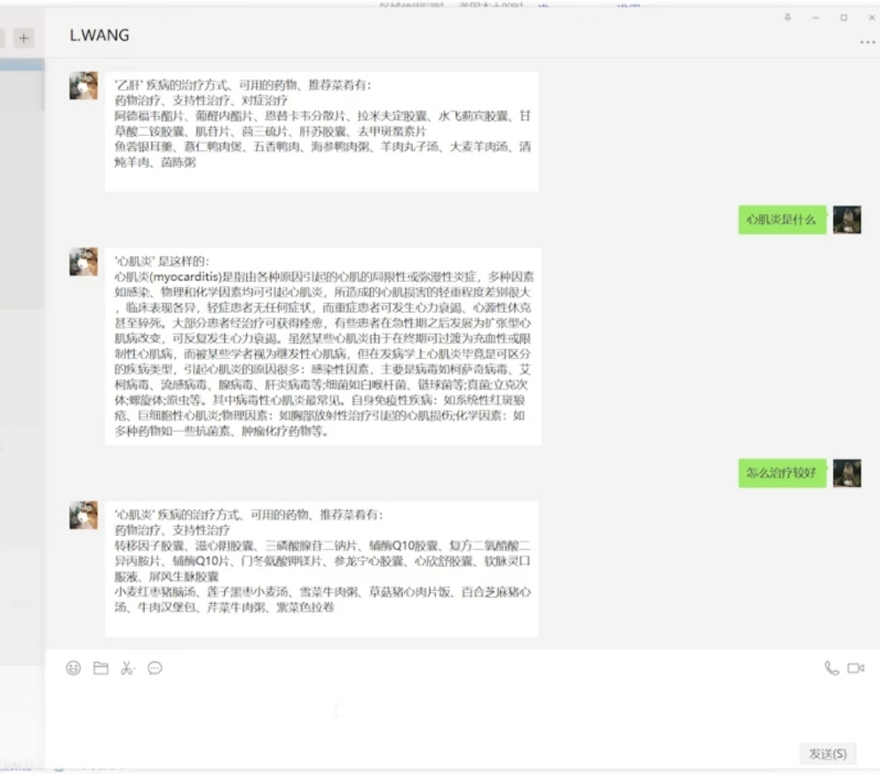
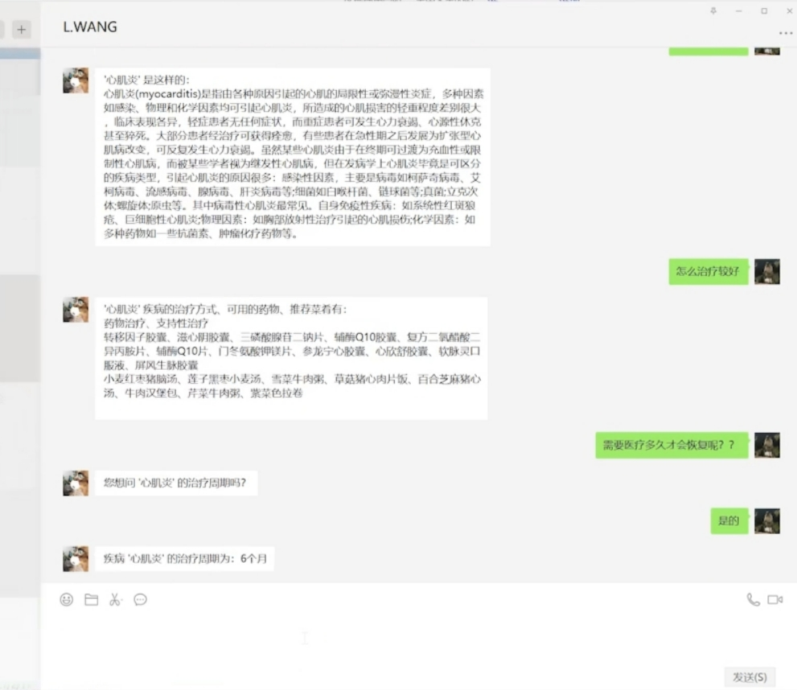
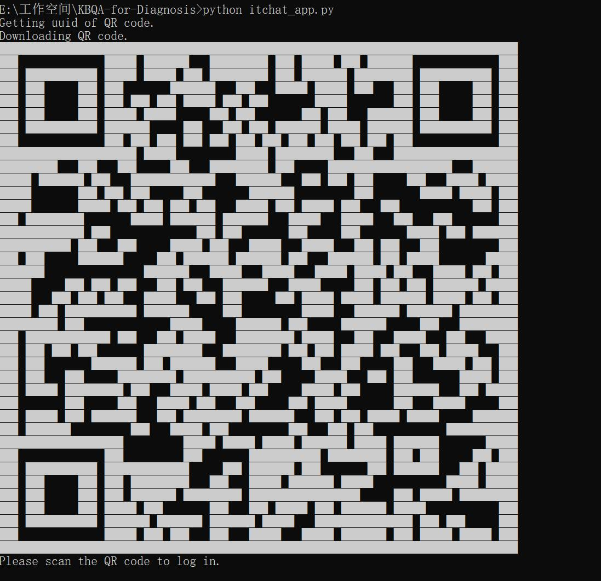
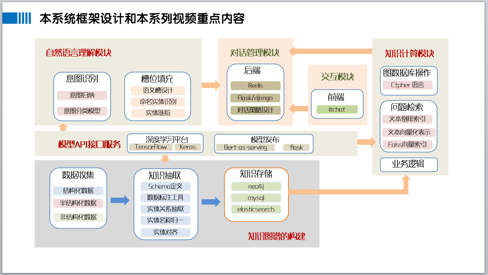
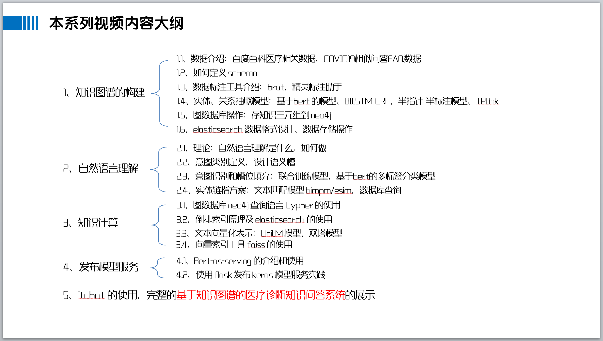

## 基于知识图谱的医疗诊断知识问答系统

号外，我开通了一个知识星球，在里面我将提供一下服务：

- 上传项目里所有涉及到的代码、数据、模型
- 回答每一个球员的项目相关问题，即使再简单的基础问题
- 解决你在运行项目代码时的 BUG 问题
- 一些在学习NLP算法时遇到的一些困恼
- 校招及初级社招简历中的算法项目的润色指导
- 后续的NLP基础课程的一切答疑（课程目录大纲在最后）


### 环境

- python    >= 3.6
- pyahocorasick==1.4.2
- requests==2.25.1
- gevent==1.4.0
- jieba==0.42.1
- six==1.15.0
- gensim==3.8.3
- matplotlib==3.1.3
- Flask==1.1.1
- numpy==1.16.0
- bert4keras==0.9.1
- tensorflow==1.14.0
- Keras==2.3.1
- py2neo==2020.1.1
- tqdm==4.42.1
- pandas==1.0.1
- termcolor==1.1.0
- itchat==1.3.10
- ahocorasick==0.9
- flask_compress==1.9.0
- flask_cors==3.0.10
- flask_json==0.3.4
- GPUtil==1.4.0
- pyzmq==22.0.3
- scikit_learn==0.24.1

### 效果展示

为能最简化使用该系统，不需要繁杂的部署各种七七八八的东西，当前版本使用的itchat将问答功能集成到微信做演示，这需要你的微信能登入网页微信才能使用itchat；另外对话上下文并没有使用Redis之类的数据库实时存储到内存里，而是使用json文件的存、读进行的。

能够回答哪些疾病相关知识，可以参考[这个疾病实体字典里的疾病](https://github.com/wangle1218/KBQA-for-Diagnosis/blob/main/knowledge_extraction/bilstm_crf/checkpoint/diseases.json)；另外目前并没有实现实体链指的功能（因为没有相关的开源数据集），因此现在只支持“疾病”实体的完整、准确输入的解析。







[完整演示视频](https://www.bilibili.com/video/BV1Np4y1471Z/)

### 如何运行demo代码

0. **下载意图识别模型文件**

由于该模型是使用bert训练的，比较大，因此我上传到百度网盘了，有需要的可以自己去下载，然后将其放到目录`KBQA-for-Diagnosis\nlu\bert_intent_recognition\checkpoint`下。

**下载地址**

链接：https://pan.baidu.com/s/1HYB3RwfDs_JcreuEYH51Tw 
提取码：b3cd 
复制这段内容后打开百度网盘手机App，操作更方便哦

**下载roberta预训练模型**
[从哈工大官方github下载，点这里](https://github.com/ymcui/Chinese-BERT-wwm#%E4%B8%AD%E6%96%87%E6%A8%A1%E5%9E%8B%E4%B8%8B%E8%BD%BD)，下载RBT3,Chinese 版本（貌似是这个，反正是一个三层的简单版）；[或者直接点这里用讯飞云下载](http://pan.iflytek.com/#/link/275E5B46185C982D4AF5AC295E1651B6)

下载好后解压放在项目路径下，然后在bert意图识别文件夹的 `app.py`代码里改一下预训练模型的路径。

1. **启动neo4j**

打开cmd ，进入安装目录，输入`neo4j.bat console`就行；如果是Linux系统，你可以输入`./neo4j start`后台启动

```
C:\Users\wangle>d:

D:\>cd D:\neo4j-chs-community-4.2.2-windows\bin

D:\neo4j-chs-community-4.2.2-windows\bin>neo4j.bat console
Java HotSpot(TM) 64-Bit Server VM warning: Option UseBiasedLocking was deprecated in version 15.0 and will likely be removed in a future release.
2021-05-30 03:27:00.749+0000 INFO  Starting...
2021-05-30 03:27:02.126+0000 INFO  ======== Neo4j 4.2.2 ========
2021-05-30 03:27:03.404+0000 INFO  Performing postInitialization step for component 'security-users' with version 2 and status CURRENT
2021-05-30 03:27:03.405+0000 INFO  Updating the initial password in component 'security-users'
2021-05-30 03:27:03.617+0000 INFO  Bolt enabled on localhost:7687.
2021-05-30 03:27:04.194+0000 INFO  Remote interface available at http://localhost:7474/
2021-05-30 03:27:04.194+0000 INFO  Started.
```

2. **启动意图识别和槽位填充服务**

依次双击`run_intent_recog_service.bat` 和 `run_ner_service.bat` 两个 bat 文件，打开后不要关闭；如果你是Linux系统，请将其改成 shell 脚本 然后运行。

3. **启动itchat**

打开一个新的cmd，进入项目文件夹路劲，输入：

```
python itchat_app.py
```

之后微信扫描二维码就可以在微信里做问答了。



提示以下信息表明登入成功，如果报错，说明你的微信不能登入网页微信，可以换一个注册时间有7/8年的微信试试

```
Login successfully as 你的微信账号
Start auto replying.
```

### 后期计划

系列视频持续更新中……，~~后期代码也将一并上传~~（第一版demo已全部上传）

当前实现的是最小演示版本，后期会加上Redis、elasticsearch、tf-serving等技术栈，如果有前端配合的话也可以将问答服务发布成后端接口，这样就可以做工程化部署了。

[点击这里观看视频](https://www.bilibili.com/video/BV1ev4y1o7zj/)

本项目系列视频大纲如下，最后可能会有细微差别，影响不大




