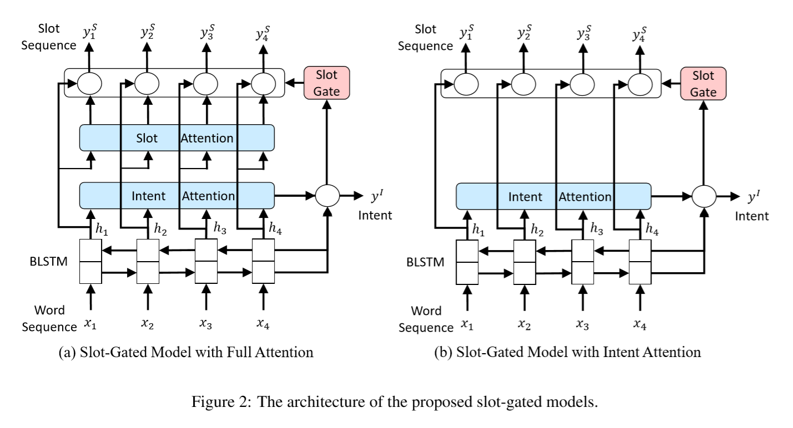
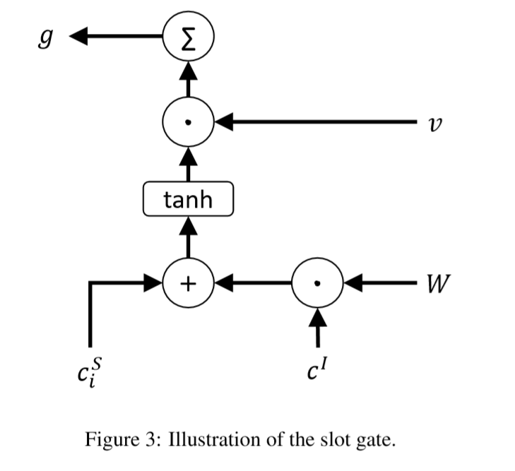
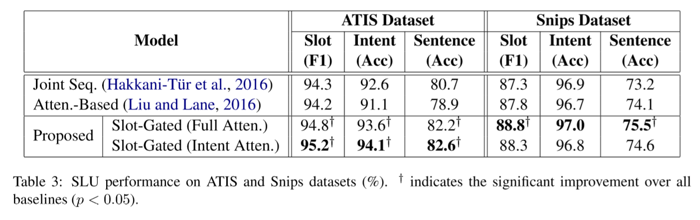
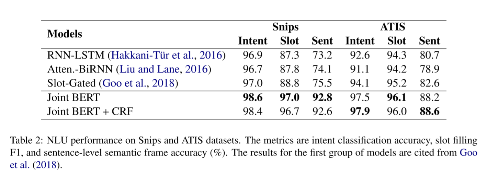
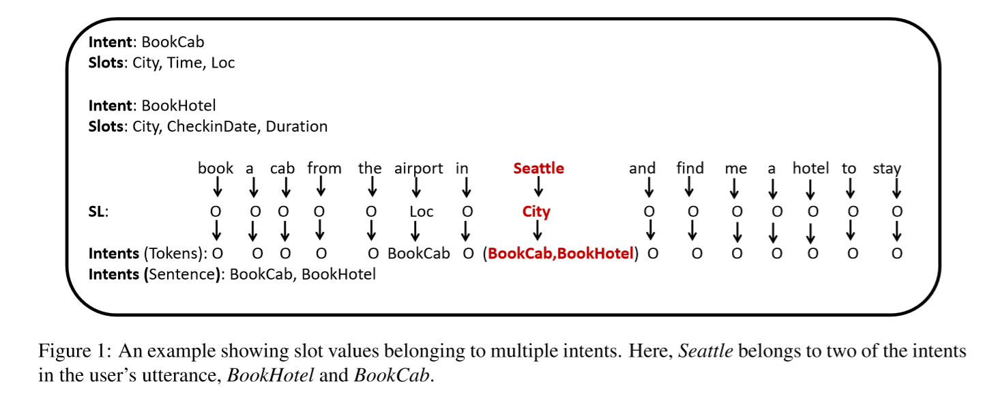
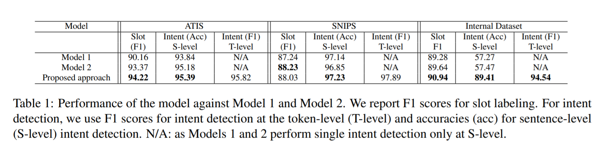

## 介绍几个意图识别和槽位填充联合训练模型
在很久之前我写了一篇[文章](https://mp.weixin.qq.com/s/QBV5FFg7wIHBwYKDcz5VTQ)讲自然语言理解（NLU），其中阐述了什么是意图识别、什么是槽位填充，收获了不少彩虹屁。在那个文章里我承诺说写一篇关于意图识别和槽位填充的联合训练模型相关的文章，于是就很多朋友都在追更，都在问下一篇在哪里，拖了快一年该把这个坑给补上了（其实网上已经有很多相关论文阅读笔记了）。

正如上文说的，做NLU（或者叫 SLU，Spoken language understanding）必不可少的需要做意图识别和槽位填充两个工作，这两者可以用 pipeline 的方式依次进行（先后顺序也可以随意，视具体需求而定），但是我们更有理由使用一个端到端的模型来同时解决这两个工作，原因在于意图和槽位具有强相关性，使用单个模型做多任务学习可以学习到更好、更丰富的表达特征来提升意图识别和槽位填充的性能。本文选择最近几年这个领域有代表性的几篇论文来做一下分享。

### 一、Slot-Gated Modeling for Joint Slot Filling and Intent Prediction

```
地址：https://www.aclweb.org/anthology/N18-2118/
代码：https://github.com/MiuLab/SlotGated-SLU
```

本文作者认为以前的工作虽然也有做多任务联合训练的，但是模型里并没有明确的建立槽位和意图之间的联系，而仅仅将两个任务的损失函数合并起来优化。作者提出一个槽位门控机制（slot-gated mechanism）来解决上述缺陷，达到较好的效果。



如上图所示就是该模型的结构图，作者提出了两个模型结构，大体上相似，只是一个有两个注意力机制叫 Full Attention，另一个只有一个注意力叫 Intent Attention；模型使用双向的LSTM来做编码层，然后做Attention，接着就是两个任务的联合训练了，一个是序列标注任务，一个多分类任务（利用BILSTM的最后一个隐向量做分类）；另外，用来做序列标注的每个token的语义向量（ slot context vector，BILSTM的隐向量经过Attention之后的结果）都用 slot gate进行了处理，这个gate可以和LSTM里面的遗忘门、输入门进行对比理解一下，它的作用是将 intent context vector （用来做意图分类的语义向量）以一定的方式融入到每个token的slot context vector里。



如上图所示就是slot-gated的示意图了，这里详细讲一下具体怎么做。$$𝑐_𝑖^𝑆$$ 表示slot context vector，$$𝑐^𝐼$$ 表示intent context vector，$$v$$ 和 $$W$$ 分别表示可训练的向量和矩阵参数，slot gate 的值计算如下：
$$
g =\sum v·tanh(c_i^S + W \cdot c^I) \qquad （1）
$$
$$g$$ 可以认为是一个权重来组合 $$c_i^S$$ 和 $$c^I$$，最终可以用来做序列标注的训练，这里序列标注的解码没有使用CRF，而是直接使用的softmax做多分类解码，计算公式如下：
$$
y^S_i = softmax(W^S_{hy}(h_i + c^S_ i \cdot g))  \qquad （2）
$$
如果不使用 slot attention 的话那么（1）式中的 $$𝑐_𝑖^𝑆$$ 需要用 $$h_i$$ 代替，（2）也需要变成：
$$
y^S_i = softmax(W^S_{hy}(h_i + h_ i \cdot g))  \qquad （3）
$$
根据实验数据不同作者使用不同的模型结构得到不同的结果，如下图所示，在 ATIS 上仅使用 Intent Attention 达到最优结果，而在 Snips 上使用 Full Attention 达到最好结果，作者认为原因是前者数据集比较简单，加了slot attntion反而不好，而后者数据集比较复杂。



## 二、BERT for Joint Intent Classification and Slot Filling

```
地址：https://arxiv.org/abs/1902.10909
代码：https://github.com/monologg/JointBERT
```

从题目可以看出本文是使用了BERT来进行语义编码，然后做序列标注任务和多分类任务的联合训练，效果当然是蹭蹭的往上涨。但是本文没有独特的地方，没什么好讲的，有兴趣的自己去看看原文吧。



## 三、Joint Multiple Intent Detection and Slot Labeling for Goal-Oriented Dialog

```
地址：https://www.aclweb.org/anthology/N19-1055.pdf
```

在现实应用中，一句话可能包含了多个意图，而且对于不同的意图同一个 token 可能对应不同的槽位。一个简单的例子，比如 “我需要买一张万达广场电影院的电影票，然后再帮我定一下那里的餐厅”，这里就有两个意图：定电影票和定餐厅。针对定电影票“万达广场电影院”应该是“影院”槽位的值；针对定餐厅“万达广场”应该是“地点”槽位的值。虽然这个例子举的很随意，但是我想并不影响我第一句话所想表达的意思。在以前的研究中都是针对单意图进行识别的，本文提出了一个模型来解决这样多意图识别及 token level slot label多类别的问题。



本文作者将多意图识别的问题转化为多标签分类问题，且从sentense-level 和 token-level 两个层面来预测语句的意图，如上图所示，seattle 被预测为 BookCab 和 BookHotel 两个意图。另外作者借助了上述第一篇论文的 slot-gated 思想将 intent 和 slot 建立关联。


**Sentense-level  intent detection**

如上图所示就是本文所提出的模型的结构，模型使用双向 BILSTM 对输入的句子进行编码；在 sentence-level 层面做意图识别时，取前向和后向的最后一个 token 的输出的拼接向量 $$h^{enc}_i = [fh_i , bh_i ]$$ ，然后接一个全连接层， 然后使用多个 sigmoid 做多标签分类。

**Slot labeling**

对于槽位标签的预测，模型先使用 LSTM 进行解码，在每一个 step i，解码状态计算公式如下：
$$
h^{S,des}_i = LSTM(h^{S,des}_{i-1},y_{i-1}^S,h^{enc}_i,c^S_i,c^I) \qquad （4）
$$
其中上下文向量 context vector $$c^S_i$$ 表示上述双向LSTM编码的隐向量的加权平均，计算如下：
$$
c^S_i = \sum ^N _{j=1} \alpha ^S_{i,j} h_j^{enc} \qquad （5）
$$

$$
\alpha ^S_{i,j} = \frac{exp(e_{i,j})}{\sum ^N _{k=1}exp(e_{i,k})} \qquad （6）
$$

$$
e_{i,k} = g(h^{S,des}_{i-1},,h^{enc}_k) \qquad （7）
$$

上式中 $$g(.)$$ 指前馈神经网络层。然后将解码输出 $$h^{S,des}_i$$ 输入给softmax 进行多分类，作者说也做过实验使用 CRF 来做序列预测，但是实验结果表明效果没有 softmax 好。

文章提到的使用 slot-gated ，光从论文原文来说我是看不出来它是怎么应用到模型中的，根据上文介绍的 slot-gated 的计算公式如下：
$$
gS =\sum v·tanh(c_i^S + W \cdot c^I) \qquad （8）
$$
最终 slot label 的计算公式如下：
$$
y_i^S = softmax(g(h^{enc}_i + c^S_i \cdot gS)) \qquad （9）
$$
公式（9）和（4）是两种不同的方案，这两个作者进行组合了还是分别作了实验呢，作者好像没写清楚。

**Token-level  intent detection**

对于 roken-level 的意图识别，模型任然使用 LSTM 来解码，对于每一个解码步：
$$
h^{MI,des}_i = LSTM(h^{MI,des}_{i-1},h^{enc}_i,c^{MI}_i) \qquad （10）
$$
其中 $$c^{MI}_i$$ 的计算方式和上面 $$c^{S}_i$$  的计算方式一样，最后将 $$h^{MI,des}_i$$ 送入一个全连接层，使用 sigmoid 做激活函数，做多标签分类。

模型在各数据集上的评测结果如下所示：

