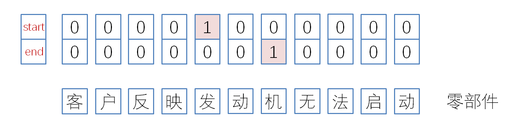
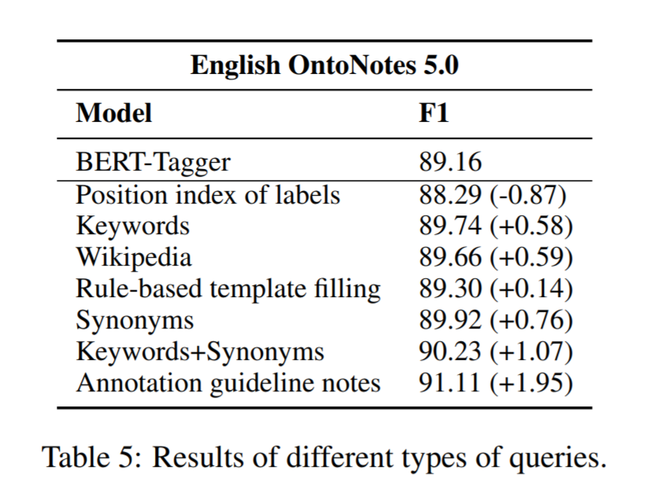
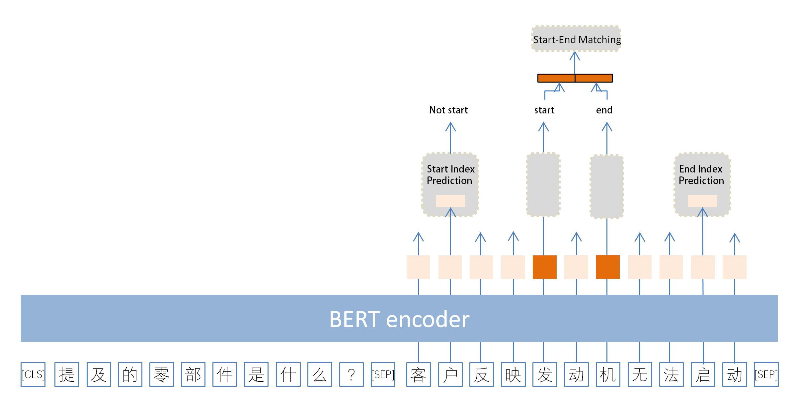
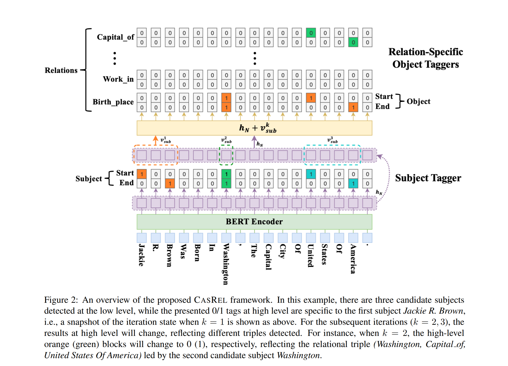
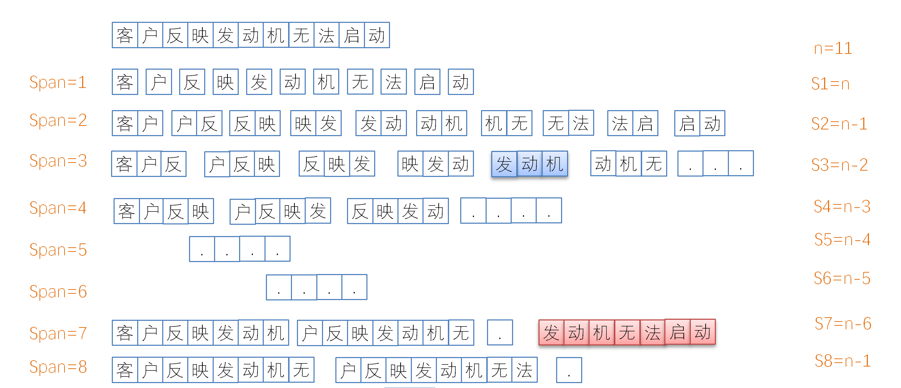
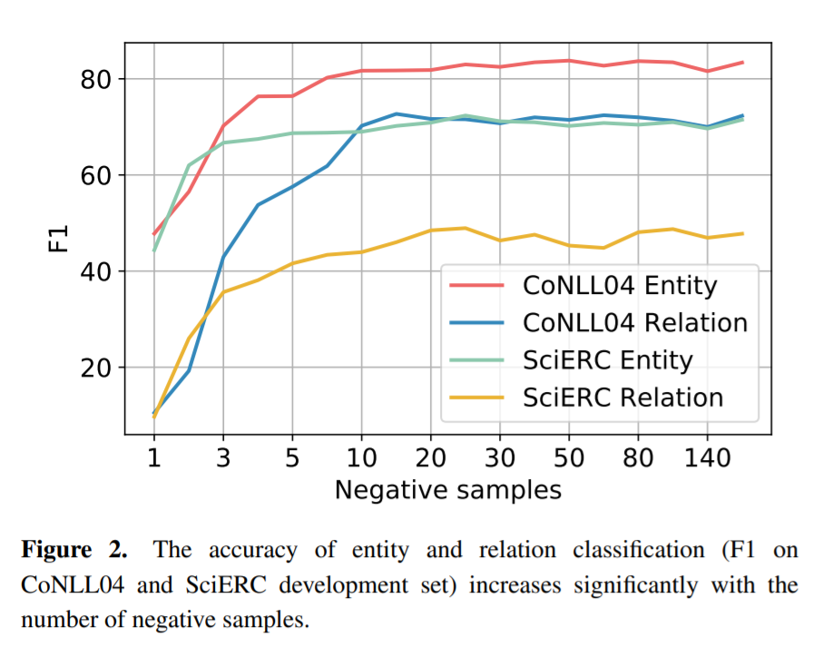
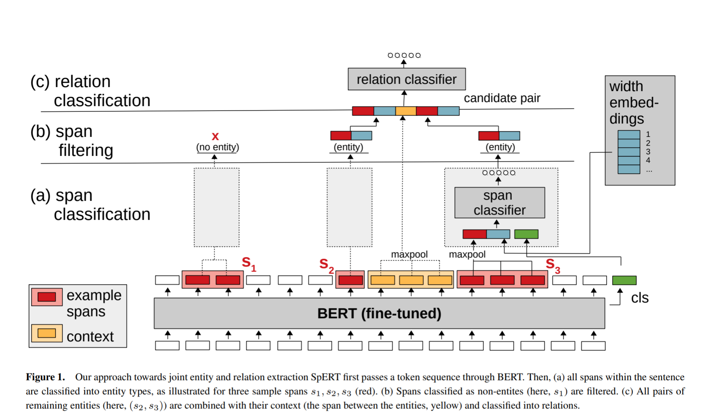
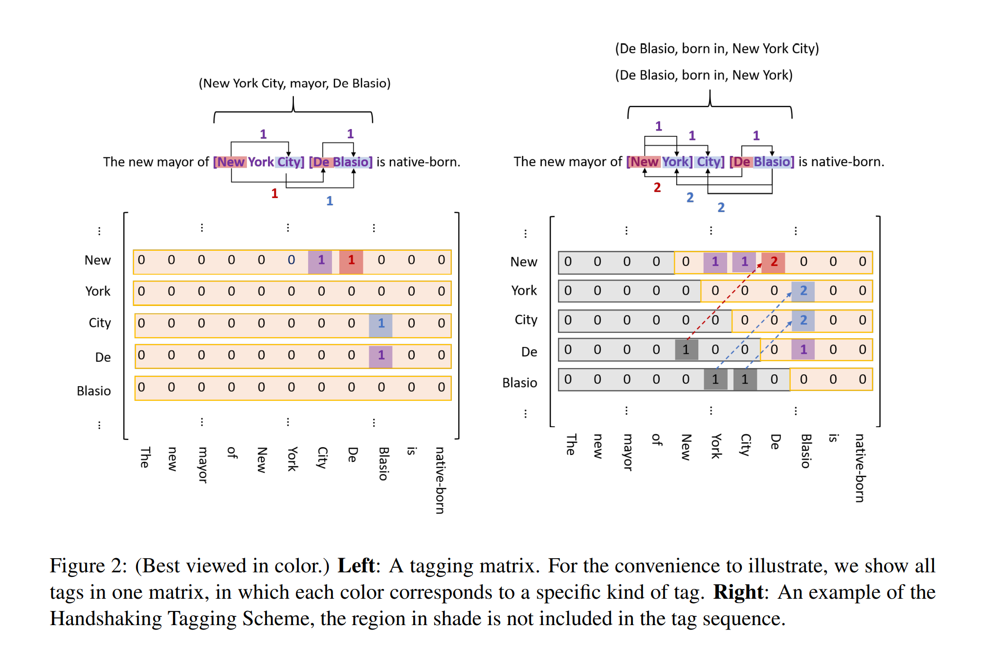
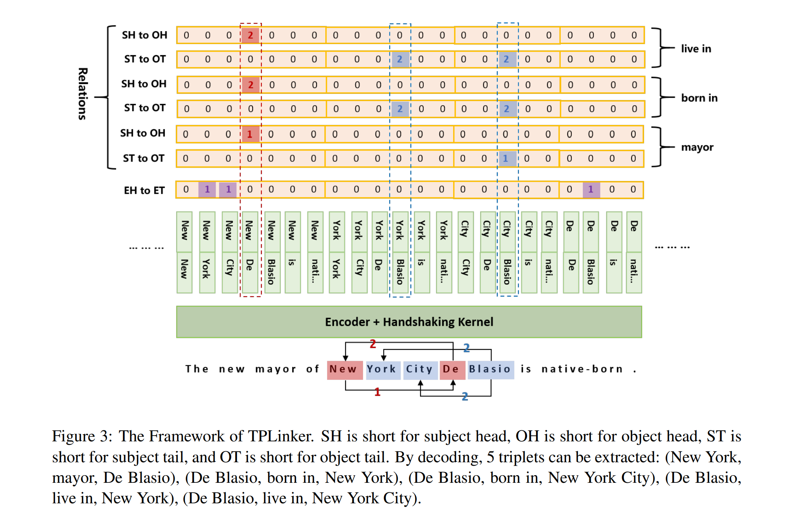

## 实体关系抽取代表性SOTA论文速读

### 一、MRC-QA+指针标注

论文：[A Unified MRC Framework for Named Entity Recognition](https://arxiv.org/pdf/1910.11476.pdf)，[开源地址](https://github.com/ShannonAI/ mrc-for-flat-nested-ner.)

MRC 指 machine reading comprehension ，即机器阅读理解，该论文模仿 MRC 的做法来做 NER，能够较好的解决嵌套实体的识别问题。

我们知道 BERT 的输入形式为 ` [CLS] sent_1 [SEP] sent_2 [SEP]`，输入为两个句子，由于NER 任务的训练只是针对一个句子来的，所以一般的利用 BERT 来做 NER的模型都是把第二个句子省略，只用一个句子做输入；本文将每一个训练样本都作为一个文档，在训练时作为 `sent_2` 输入，然后针对训练样本构造一个 query 作为`sent_1` 输入，这个query 一般是问句，这样其实就构造成 (query, document) 二元组了，将其输入 BERT 模型相当于训练问答模型，这样操作就是 MRC-QA 化啦。

指针标注就是不同于序列标注，它只标注实体的头和尾，中间不标注，这样转化成输入给模型的标签其实就是一个`sentence_len * 2` 的矩阵，一行表示实体头的label，一行表示实体尾的label ，如下图所示：

另外，既然需要做问答，已经有了问题和参考文档，那当然还需要答案了，这里答案就是 NER 任务中训练样本中标注的实体了。根据指针标注的方式，如果样本序列为$$X=\{x_1,x_2,...,x_n\}$$，那么问答的“答案”为 $x_{start,end}$，这样 (query, document) 二元组变成三元组
$$
(q_y,x_{start,end},X)
$$

#### 如何构造 query ？

该模型的关键就是如何构造 query，要保证其为问答提供有关实体信息的先验知识。论文中给出以下几种构造方式

- **Position index of labels 标签位置**: a query is constructed using the index of a tag to , i.e., ”one”, ”two”, ”three”. 
- **Keyword 关键词**: a query is the keyword describing the tag, e.g., the question query for tag ORG is “organization”. 
- **Rule-based template filling 规则模板**: generates questions using templates. The query for tag ORG is “which organization is mentioned in the text”. 
- **Wikipedia 维基百科解释**: a query is constructed using its wikipedia definition. The query for tag ORG is ”an organization is an entity comprising multiple people, such as an institution or an association.” 
- **Synonyms 同义词**: are words or phrases that mean exactly or nearly the same as the original keyword extracted using the Oxford Dictionary. The query for tag ORG is “association”. 
- **Keyword+Synonyms关键词+ 同义词**: the concatenation of a keyword and its synonym. 
- **Annotation guideline notes 注释指南**: is the method **we use in this paper**. The query for tag ORG is ”find organizations including companies, agencies and institutions”.

#### 模型结构

模型主干是 BERT ，使用形如 $${[CLS], q_1, q_2, ..., q_m, [SEP], x_1, x_2, ..., x_n}$$ 作为输入，得到最终的上下文向量表达矩阵 $$E \in R^{n*d}$$ ，d 表示 BERT 最后一层的向量维度，之后将 query 的表达向量删除不要；最后就是三个任务的训练了。

1. **Start Index Prediction**

$$
P_{start} = softmax_{each row}(E \cdot T_{start}) \in R^{n*2}
$$

也就是将 BERT 的输出接一个全连接层，然后用 softmax 进行解码。上式 $$T_{start}\in R^{n*2}$$ 指全连接层的权重。$$P_{start}$$ 表示 query 中提及的实体的头位置的概率。

2. **End Index Prediction**
$$
P_{end} = softmax_{each row}(E \cdot T_{end}) \in R^{n*2}
$$

3. **Start-End Matching**

如果一个样本里的某个类型的实体仅有一个，也就是一个 $$i_{start}$$ 和  $$i_{end}$$ ，那么直接将这个片段序列当做query 里面提及的实体类型就行；而如果样本里有多个实体出现，那么必然会预测出多个 start 和end，这时就需要确定哪些 start 和哪些 end 可以构成一个实体了，这就是需要做 Start-End Matching 的工作了。

本模型将所有可以组合成的片段进行二分类，判断片段是否是一个实体。
$$
P_{i_{start},j_{end}} = sigmoid(m \cdot concat(E_{i_{start}} , E_{j_{end}} ))
$$
将组成片段的 start 和 end 的向量拼接，然后接一个全连接层，用 sigmoid 进行二分类解码。$$m \in R^{1*2d} $$ 表示全连接层的权重参数。

#### 损失函数

上述三个任务的损失加和。
$$
L_{start} = CE(P_{start}, Y_{start})
$$

$$
L_{end} = CE(P_{end}, Y_{end})
$$

$$
L_{span} = CE(P_{start,end}, Y_{start, end})
$$

$$
L = αL_{start} + βL_{end} + γL_{span}
$$

Y 表示真实标签，P 就是上文提到的对标签的预测，CE 表示交叉熵损失函数，源代码中使用的是 BCEWithLogitsLoss 和 Dice。

### 二、层叠式指针标注

论文：[A Novel Cascade Binary Tagging Framework for Relational Triple Extraction](https://arxiv.org/pdf/1909.03227.pdf)，[开源地址](https://github.com/weizhepei/CasRel)

该论文是做实体和关系的联合抽取，采用层叠式指针标注框架进行训练，同样可以很好的解决嵌套实体识别的问题和 EPO 实体对多关系问题。

#### 什么是层叠式指针标注？

在上文中我们介绍了指针标注规则，也就是构造一个 $$sentence\_len * 2$$ 的矩阵，一行表示实体的头，一行表示尾，只将头尾的对应索引位置标为1，其他索引都为0。那么层叠式指针标注其实就是构造多个 $$sentence\_len * 2$$ 的矩阵进行叠加了，有多少个关系就有多少个 $$sentence\_len * 2$$ 的矩阵。

#### 模型结构

首先看一下论文中的示意图

模型首先在输入的句子中识别三元组 SPO 中的所有 subject，然后，针对候选subject 和所有关系进行一一匹配判断，看是否有 object 存在。

1. **Subject Tagger** 

通过 BERT 的输出向量来直接识别所有可能的 subject，上图中 $$h_N$$ 表示经过N层的BERT后的输出向量。由于每一层都是 $$sentence\_len * 2$$ 的矩阵，也就是针对每个 token 都有两个二分类，用来判断该索引位置的 tag 是 0 还是 1：
$$
p^{start_s} _i = \sigma (W_{start}X_i + b_{start})
$$

$$
p^{end_s} _i = \sigma (W_{end}X_i + b_{end})
$$

$$p^{start_s} _i$$ 和 $$p^{end_s} _i$$ 表示输入的句子中第 i 个 token 是 subject 的头和尾的概率。$$X_i$$ 表示token的向量表示，也就是经过 BERT 之后的向量 $$h_N[i]$$ ，$$W_{(.)}$$ 表示可训练的参数（其实就是对每一个 token 的BERT 输出向量链接一个全连接然后用sigmoild 进行二分类）。该二分类损失函数为最大似然函数：
$$
p_{\theta}(s|X) = \prod_{t \in \{start\_s,end\_s\}} \prod_{i=1}(p^t_i)^{I\{y^t_i=1\}}(1-p^t_i)^{I\{y^t_i=0\}}
$$
其中 $$I\{z\} = 1$$ 如果z 为真，如果为假则等于0，$$\theta$$ 表示可训练的参数。

如果识别到多个 subject，那么将识别到的 start 和 end 按就近原则进行组合成 span，如上图例子所示，第一个 start 是 jackie，第一个 end 是 brown，那么组成的一个实体将是 “jackie r. brown”。

2. **Relation-specific Object Taggers**

提取到subject 之后，遍历每个关系，然后判断subject 和特定的predicate是否有 obejct。也就是求概率：
$$
p(o | s_j,p_k)
$$
即给定 j subject 和 k predicate 的条件下，求 object 的概率，这里object 也是和subject 一样的计算方式：
$$
p^{start_o} _i = \sigma (W^r_{start}(x_i + v^k_{sub}) + b^r_{start})
$$

$$
p^{end_o} _i = \sigma (W^r_{end}(x_i + v^k_{sub}) + b^r_{end})
$$

判断输入的句子中第 i 个token 是 object 的头的概率和尾的概率。其中 $$v^k_{sub}$$ 如上图所示，其实就是 subject 的 span 片段向量的最大池化。损失函数任然是最大似然。

### 三、片段排列

论文：[Span-based Joint Entity and Relation Extraction with Transformer Pre-training](https://arxiv.org/pdf/1909.07755.pdf)，[开源地址](https://github.com/markus-eberts/spert)

该论文是做实体和关系的联合抽取，在实体抽取层面，对样本的标注即不用序列标注也不用指针标注，而是将训练样本按照不同序列长度进行切分得到若干个候选实体片段，然后使用分类器对片段进行分类判断是否非实体。该模型同样能很好的解决嵌套实体的问题。

#### 如何构造 Span？

如下图所示，可以设置最大Span 的长度，假设为 T，然后将训练序列按照 1 ~ T 的长度用滑动窗口按照步幅为1进行划分。

显然的这样会产生大量负样本，因此需要对候选片段有所选择，同时由于是需要做实体分类的，因此针对于负样本的采样也要考虑一下。

用 $$N_e$$ 和 $$N_r$$ 分别表示实体和关系的负样本采样数量，实验发现 $$N_e$$ 和 $$N_r$$ 越大，模型效果越好，且达到 100 之后结果会趋于稳定。

#### 模型结构

模型 SpERT 同样是用 BERT 做主干的，整个结构如下图所示：

模型由 span classification 、 span Filtering 和 relation classification 三部分组成。 span classification 和 Span Filtering 对实体进行筛选和识别，relation classification 进行关系抽取。

1. **span classification 片段分类**

使用候选片段集合 $$s:=(e_i,e_{i+1},...,e_{i+k})$$ 作为输入，预定义的实体类型集合为 E，那么分类模型的标签为 $$E \cup \{none\}$$ ，其中 none 表示非实体。

如上图所示 BERT 的输出向量为红色，那么将片段向量进行融合 $$f(e_i,e_{i+1},...,e_{i+k})$$，该模型使用的融合方式 $$f$$ 为最大池化；另外，会生成一个span长度嵌入 embedding，如果给定的 span 的长度为 k+1 ，那么就会在上述span长度 embedding 矩阵中查找到相对应的 embedding 向量 $$w_{k+1}$$ 和$$f(\cdot)$$ 进行拼接；除此之外再和 BERT 的 [CLS] token 的向量进行拼接。这三部分向量拼接之后输入分类器，使用$$softmax$$ 进行分类：
$$
e(s) := f(e_i,e_{i+1},...,e_{i+k}) ◦ w_{k+1} \qquad (1)
$$

$$
x^s:= e(s) ◦ c \qquad (2)
$$

$$
\hat{y}^s = softmax(W^s \cdot x^s + b^s) \qquad (3)
$$

这里$$ ◦ $$ 表示向量拼接，$$c$$ 表示 [CLS] 向量，$$W^s$$表示分类器（全连接层）的权重参数，$$b^s$$ 表示偏置常数。

2. **Span Filtering 片段过滤**

正如上文所说的片段排列方法会产生大量负样本，因此需要对一些负样本进行过滤筛选。这里过滤掉分类器认为不是实体的 Span，以及长度大于 10 的 Span。

3. **Relation Classification 关系分类**

针对每两个候选片段 $$(s_1,s2)$$，它们都有可能具有某种关系，假设 $$R$$ 为预定义的所有的关系集合。那么输入关系分类器的是什么呢，除了两个候选实体的向量表达，这里使用式（1），还应该包含着两个实体的上下文语义向量，本文将两个片段的中间部分 token 的向量进行最大池化之后作为上下文特征，如上图黄色部分所示，如果候选片段之间没有 tokens ，那么 $$c(s_1,s_2) = 0$$ 。
$$
x^r_1 := e(s_1) ◦ c(s_1, s_2) ◦ e(s_2)
$$

$$
x^r_2 := e(s_2) ◦ c(s_1, s_2) ◦ e(s_1)
$$

上述两式交换了头为实体的顺序，将拼接向量输入给单层的全连接层
$$
\hat{y}^r_{1/2} = \sigma (W^r \cdot x^r_{1/2} + b^r)
$$
这里 $$\sigma$$ 表示 sigmoid 激活函数，如果总共有 n 个关系，那么输出层神经元个数为 n，然后对每一个神经元进行 sigmoid  激活 二分类，判断是否是某个关系，给定阈值 $$\alpha$$ ，如果激活的得分大于阈值则认为这两个候选片段是具有某种关系的。

#### 训练

模型有两个分类任务，一个片段分类，一个关系分类，他们都需要生成负样本；前者使用真正的标注出来的实体作为正样本，使用其他没标注的片段随机选择一些做负样本（如果有漏标的话估计效果不太好）；后者使用具有关系的两个实体作为正样本，其他没有关系的实体组合作为负样本。

因此该模型有两部分损失，总损失为：
$$
L = L^s + L^r
$$

### 四、握手标注（handshaking tagging scheme）

论文：[TPLinker: Single-stage Joint Extraction of Entities and Relations Through Token Pair Linking](https://arxiv.org/pdf/2010.13415.pdf) ，[开源地址](https//github.com/131250208/TPlinker-joint-extraction)

TPLinker 模型也是可以进行实体和关系的联合抽取，也能够解决嵌套实体识别的问题，还可以解决暴露偏差（exposure bias）的问题，还能解决关系重叠问题。另外上述几篇实体关系联合抽取的论文都是多任务、分阶段抽取 SPO 三元组的，而本文 TPLinker 模型可以通过单阶段（ one-stage）抽取 SPO。

现有的大部分做实体关系抽取的模型为了解决 EntityPairOverlap (EPO，实体对重叠问题，也就是一对实体subject和object之间存在多种关系) 和 SingleEntiyOverlap (SEO，单实体重叠问题，也就是同样的object/subject和关系，但是有不同的subjec/object) 问题，都会使用  decoder-based（编码） 和 decomposition-based （解码）的两阶段方式训练模型。

两阶段的实体关系抽取模型虽然都是 end2end 的，但是训练时还是会分阶段的，首先会训练识别 subjec，然后利用 subject 的信息去训练识别关系和object。针对编码阶段，这样在训练时 subject 用的  ground truth tokens，然后在推理时，subject 是由模型自身预测出来的；也就是训练和推理 subject 的分布不同了。解码阶段也是一样训练时用到 gold subject entity 作为输入指导模型提取object和关系，然而推理时还是只能用到模型自身的预测作为下一阶段的输入。这就是所谓暴露偏差。

TPLinker 是 **T**oken **P**air **L**inking 的缩写，给定一个句子，两个索引位置$$p_1,p_2$$，一个指定的关系 $$r$$，TPLinker 回答以下三个问题：

1. $$p_1,p_2$$ 是否是同一个实体的的开始位置和结束位置， entity head to entity tail (EH-to-ET)
2. $$p_1,p_2$$ 是否分别是具有关系 $$r$$ 的两个实体的的开始位置，subject head to object head (SH-to-OH)
3. $$p_1,p_2$$ 是否分别是具有关系 $$r$$ 的两个实体的的结束位置，subject tail to object tail (ST-to-OT)

#### 什么是握手标注？

握手标注机制就是针对每个关系，设计三个 token link matrices 来回答上述三个问题。

如上图左边所示的矩阵标 注，如果句子长度为 n，那么将会构造一个 n * n 的全0矩阵，仅在部分置标注为1。如图中紫色部分所示，new 这一行，city 这一列的位置的值为1，de 这一行，blasio 这一列的位置的值为1，这说明 “new york city” 和 “de blasio” 两个序列片段为一个实体；如图中红色部分所示，new 这一行，de 这一列的位置的值为1，表示分别以 "new"，和“de” 为开始位置的两个实体是具有关系的，也就是“new york city” 和 “de blasio” 有关系；如图中蓝色标注的位置，和红色标注的意思差不多，这里指俩实体的结束位置。可以明显的看到这样的标注有一些问题：

- 矩阵非常稀疏，少量值为1，大部分为0（左下三角区域），原因在于实体的尾部不可能出现在实体的开头之前，这样训练时造成大量内存的浪费；
- 能解决 SEO 问题和嵌套实体问题，但不能解决 EPO 问题，原因在于在同一个矩阵中，针对同一对实体不能标注出多个关系，只能标注一个。

针对上述两个问题，握手标注框架是这样解决的：

- 由于在一个句子中，object 可能或出现在 subject 前面，如（de blasio，born in，new york），也就是左下三角区域还是可能会有 1 的，也就是左下三角区域不能直接删除；握手标注将这些 1 映射到右上三角区域标记为 2，如上图右侧所示，这样就可以放心删除左下三角区域了；
- 为了解决 EPO 的问题，握手标注为每一个关系类型都建立一个上图右侧的那样的矩阵，这样会带来计算量增大的问题，如果预定义的关系数量为 N，那么将会有 2N+1 个序列标注子任务，而每个子任务需要编码的序列长度为 $$\frac{n^2+n}{2}$$，其中 n 表示输入的句子的长度；幸运的是握手标注框架可以使用共享的 EH-to-ET 编码层(如模型框架图所示)，这样每次只需要编码 n 个tokens.

#### 模型结构

TPLinker 模型通过将输入的句子使用编码器（BERT 或者 BILSTM）进行编码输出得到每个 token 的向量表达，然后使用握手标注机制进行解码输出 SPO 三元组。

1. **Token Pair Representation**

给定长度为 n 的句子 $$[w_!,w_2,..,w_n]$$，首先使用编码器将每个token 编码为低维向量 $$h_i$$，然后为每一对 token pair $$(w_i,w_j)$$ 生成向量表达 $$h_{i,j}$$：
$$
h_{i,j} = tanh(W_h \cdot [h_i;h_j] + b_h), \quad j>= i \qquad (1)
$$

2.  **Handshaking Tagger**

 有了 token pair $$(w_i,w_j)$$ 的向量表达 $$h_{i,j}$$，就可以通过式（3）来预测他们之间的标签了：
$$
P(y_{i,j} ) = Softmax(W_o \cdot h_{i,j} + b_o) \qquad (2)
$$

$$
link(w_i, w_j ) = arg max_l P(y_{i,j} = l) \qquad (3)
$$

 $$P(y_{i,j} = l)$$ 表示  $$(w_i,w_j)$$ 标签为 $$l$$ 的概率。

3. **损失函数**

$$
L_{link} = − \frac{1}{N} \sum_{i=1,j>=i} ^N \sum_{* \in \{E,H,T\}} logP(y^*_{i,j} = \hat{l}^*)
$$

N 表示输入句子的长度，$$\hat{l}$$ 表示真实tag，E, H, 和 T 分别表示 EH-to-ET, SH-to-OH 和ST-to-OT 的taggers 。